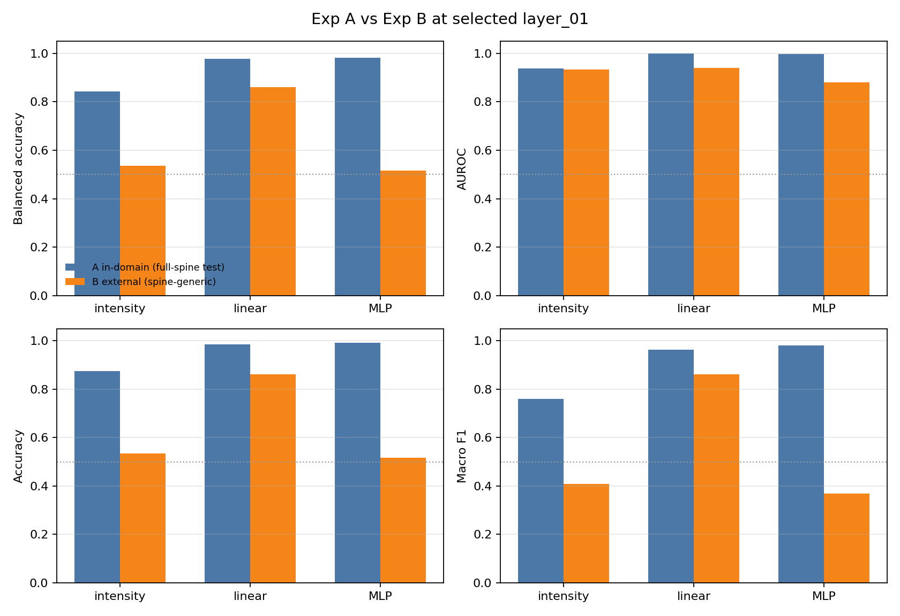
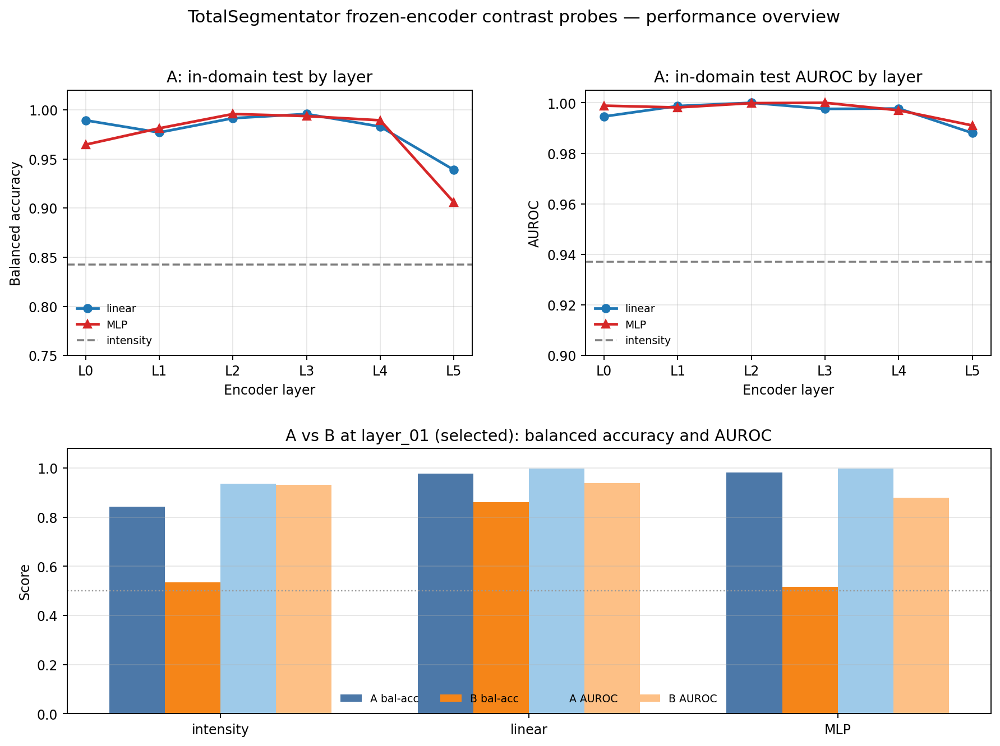
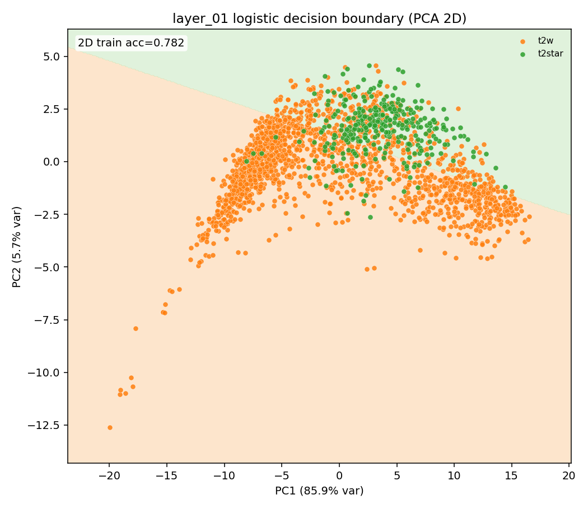
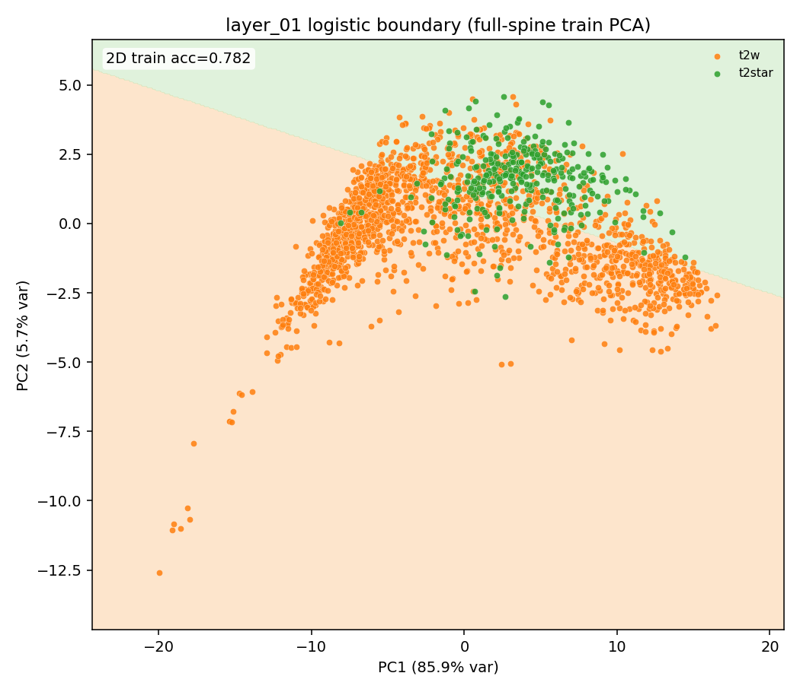
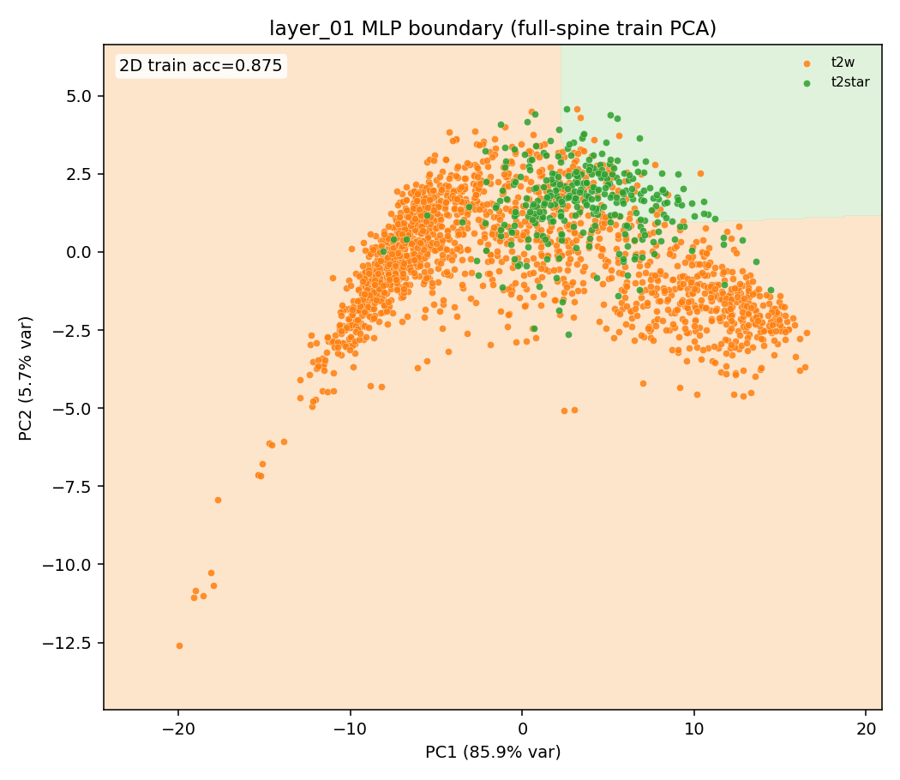
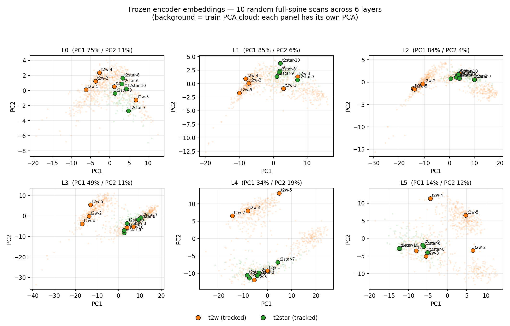

# TotalSegmentator Probe Study

[TotalSegmentator](https://github.com/wasserth/TotalSegmentator) is a public model that outlines anatomical structures in medical images. On spine MRI, its `vertebrae_mr` model marks individual vertebrae. We did not retrain it. We froze those weights and asked whether the features it already computes carry the labels we care about.

## Aim

The aim was to see whether this model already encodes **contrast** (which sequence the scan is), **VOI** (which part of the spine it covers), and **acq** (which plane it was acquired in). Training new models from scratch is expensive, and we were also data constrained. We did not have enough labelled scans to justify that cost across every variable.

We looked at this by **probing**. TotalSegmentator stays frozen. For each scan we pool one encoder layer into a single feature vector, then train a small readout on that vector:

- **Intensity baseline.** Logistic regression on simple brightness statistics, not on the learned features. This is the control.
- **Linear probe.** Logistic regression on the feature vector itself. If this works, the label is already laid out in a simple way inside the model.
- **MLP probe.** A small two-layer network on the same vector. This can pick up a more tangled signal, but it can also fit quirks that do not travel to new data.

If the linear probe can read the label, the information was already in the model. If only the MLP can, the signal is there but not in a simple form. If neither can, the model does not carry that variable in a way we can use.

The comparison below is the contrast probe: t2w versus t2*. That is the variable we had enough labels to test.

## Constraints

Two limits shaped what this probe can honestly claim.

- **Not enough labels across MRI types.** Almost all of the labelled data covers a small set of contrasts, only t2w and t2*. We did not have comparable labels for the rest of the sequences researchers use, including T1, FLAIR, and DWI.
- **Severe class imbalance.** Some classes had far more scans than others. A probe can look accurate by mostly learning the common class and still fail on the rare one. We report balanced accuracy for that reason.

## Protocol


| Item       | Setting                                                        |
| ---------- | -------------------------------------------------------------- |
| Encoder    | frozen TotalSegmentator `vertebrae_mr` (no weight updates)     |
| Task       | contrast: t2w vs t2*                                           |
| Embeddings | 3,175 scan×layer vectors across 6 encoder layers               |
| Methods    | intensity baseline, linear probe, MLP probe                    |
| Selection  | layer chosen by k-fold balanced accuracy on train (`layer_01`) |
| Training   | MLP early-stops on validation loss (patience 10, up to 500 epochs). Linear probe picks its regularization on validation. |
| External   | spine-generic, 534 scans                                       |


## Results


| Split          | Method              | Balanced accuracy |
| -------------- | ------------------- | ----------------- |
| In-domain test | linear (`layer_01`) | **0.977**         |
| In-domain test | MLP                 | **0.981**         |
| External       | intensity baseline  | 0.536             |
| External       | **linear probe**    | **0.861**         |
| External       | MLP                 | 0.517             |


Source: `[results/comparison_A_vs_B.json](results/comparison_A_vs_B.json)` (aggregate block only).

On data from the same clinical set, both the linear probe and the MLP separate t2w from t2* very well. On spine-generic, a different collection of scans, only the linear probe still holds, at about 86%. The MLP drops to about chance. A baseline that uses image brightness alone also fails there. The useful signal is in the frozen features, and a simple readout is what keeps it.

**Probe performance**





**Embedding geometry (PCA of frozen encoder features, layer 01)**

These plots are aggregate only. They do not include subject IDs or file paths.


| In-domain (linear)                                      | External (linear)                                      | External (MLP)                                   |
| ------------------------------------------------------- | ------------------------------------------------------ | ------------------------------------------------ |
|  |  |  |


**Layer sweep**



More detail: `[docs/representation-analysis.md](docs/representation-analysis.md)`

## Interpretation

There was real contrast information in the frozen features. On the clinical set, both probes separate t2w from t2* at about 98%. That signal did not fully generalize. The linear probe still works on spine-generic, but it drops to about 86%. The MLP, which looked just as strong in-domain, falls to about chance.

The most likely reason is that the training set was not diverse enough for the heavier readout. It comes from one clinical distribution. Spine-generic is a different collection: other sites, a cervical field of view, and a different mix of how the scans were acquired. Early stopping kept the MLP from memorizing the training split, but it still had enough capacity to fit quirks of that one dataset, including the class imbalance. Those quirks did not travel. The linear probe kept the part of the signal that was simple enough to share, and left the rest behind.

## Smoke

```bash
pip install -r requirements.txt
python scripts/run_smoke_probes.py
```

## Layout

```text
assets/     aggregate performance + PCA figures (no PHI)
src/        probe trainers + intensity baseline (sklearn)
scripts/    synthetic embedding smoke
results/    aggregate A/B comparison
docs/       layer-sweep + analysis notes
```

## Intentionally omitted

Real embeddings, clinical volumes, subject-level prediction CSVs, TotalSegmentator weights redistributed from upstream.